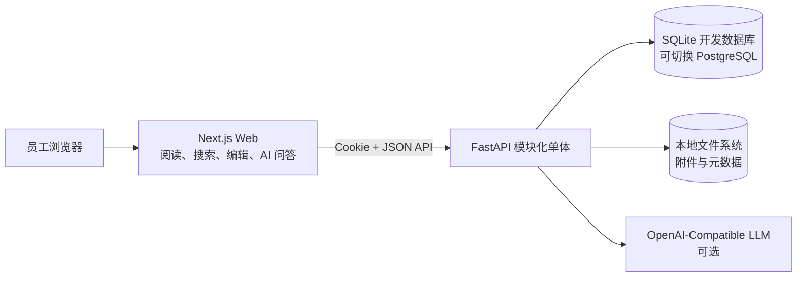
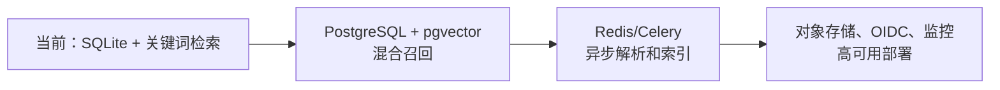

# 架构设计与关键决策

## 架构原则

- **模块化单体优先**：100 人规模先降低部署和排障复杂度，不引入微服务、Kubernetes 或 Kafka。
- **知识是唯一事实源**：已发布页面与页面版本是搜索和 AI 回答的依据。
- **权限在检索前执行**：未来的混合检索、向量检索和生成回答都必须先过滤用户无权访问的内容。
- **本地优先，接口可替换**：文件存储、数据库和模型服务均通过配置或适配层保留迁移空间。
- **可降级**：未配置 AI 服务时，搜索与知识阅读仍然可用，AI 页面显示带出处的检索结果。

## 当前架构



当前后端按领域划分为：认证、主题与标签、知识页面、搜索、附件存储、AI 适配和管理汇总。它们共享一个数据库事务边界，避免页面发布、版本和权限状态在多个服务间不一致。

## 运行组件

| 组件 | 当前实现 | 责任 |
| --- | --- | --- |
| Web | Next.js | 提供首页、登录、搜索、阅读、编辑和 AI 问答界面 |
| API | FastAPI | 认证、角色校验、知识 API、文件 API 与 AI API |
| 数据库 | SQLite 默认；SQLAlchemy 支持 PostgreSQL URL | 用户、会话、主题、标签、页面、版本、附件元数据 |
| 文件存储 | `LocalFileStorage` | 附件落盘、路径约束、哈希与安全下载 |
| LLM | 可选 OpenAI-Compatible 适配 | 基于检索上下文生成回答 |

## 核心数据模型

```text
User ──< SessionToken
User ──< KnowledgePage ──< PageVersion
Topic ──< KnowledgePage
KnowledgePage >──< Tag          （通过 PageTag）
User >──< KnowledgePage         （通过 Favorite）
KnowledgePage ──< FileAsset
```

关键实体：

- `KnowledgePage` 保存当前草稿/已发布内容、状态、负责人、主题和当前版本号。
- `PageVersion` 在每次发布时保存不可变快照；更新不覆盖旧版本。
- `PageTag` 将页面与多个标签关联。
- `FileAsset` 只保存相对存储键、原始文件名、MIME 类型、大小和 SHA-256。
- `SessionToken` 只保存会话令牌摘要，避免数据库泄露原始会话凭据。

## 请求与发布流程

### 知识发布

```text
Editor 保存页面
→ API 校验角色与主题
→ 更新 KnowledgePage
→ 发布时创建 PageVersion 快照
→ 将页面状态设为 published
→ 搜索和 AI 只读取 published 内容
```

### AI 问答

```text
用户提问
→ 身份验证
→ 在已发布知识中进行关键词召回
→ 组合页面上下文
→ 调用可选 LLM
→ 返回答案和页面级引用
```

没有配置模型、调用失败或没有检索依据时，系统不能凭空补全答案。

## 本地文件存储

存储根目录由 `FILE_STORAGE_ROOT` 控制。文件使用如下布局：

```text
storage/
├─ objects/<uuid 前两位>/<uuid 后两位>/<uuid>
├─ temp/
├─ extracted/
└─ thumbnails/
```

业务表不保存 `D:\...` 或 `/data/...` 绝对路径，只保存相对 `storage_key`。因此在 Windows、Linux 或未来迁移 S3/MinIO 时，页面和附件关系不需要改写。

## 生产演进路线



### 迁移触发条件

| 变化 | 建议动作 |
| --- | --- |
| 多人同时编辑、需要稳定备份或数据量明显增长 | SQLite 迁移至 PostgreSQL |
| 语义检索、跨语言检索或 AI 回答质量成为重点 | 启用 pgvector、Embedding、混合召回与重排 |
| 附件解析和向量生成影响页面发布速度 | 引入 Redis/Celery Worker |
| 应用多实例、文件容量增加或需要异地备份 | 本地存储迁移至 S3/MinIO/NAS |
| 已有企业身份系统 | 接入 OIDC、LDAP 或 SAML |

## 不采用的方案

- 当前不拆分微服务：规模与业务复杂度不足以抵消额外运维成本。
- 当前不单独部署 Elasticsearch 或向量数据库：先用 PostgreSQL/pgvector 作为统一的数据与权限边界。
- 当前不做 Agent 自动写库：知识发布必须有人类责任人和版本记录。
